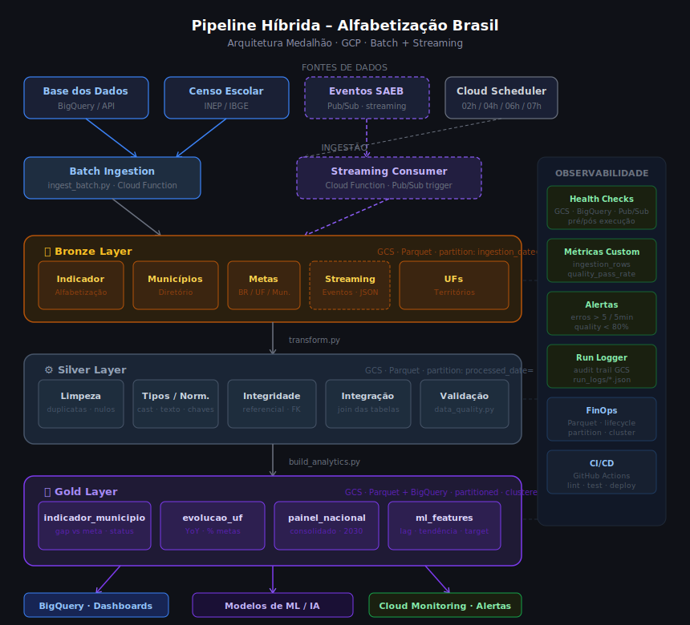

# Pipeline Híbrida para Análise da Alfabetização no Brasil
### Tech Challenge – Fase 2 | PosTech FIAP

---

## Contexto do Problema

A alfabetização na infância é um dos pilares do desenvolvimento educacional, social e econômico do Brasil. O **Compromisso Nacional Criança Alfabetizada** mobiliza União, estados e municípios para garantir que todas as crianças brasileiras estejam alfabetizadas até o final do 2º ano do ensino fundamental.

O INEP realizou, em 2023, a **Pesquisa Alfabetiza Brasil**, que definiu o ponto de corte de **743 pontos** na escala de proficiência do Saeb como nível mínimo de alfabetização. Com base nisso, criou-se o **Indicador Criança Alfabetizada**: percentual de estudantes que atingem esse patamar.

A meta nacional é que, **até 2030**, todas as crianças brasileiras estejam alfabetizadas ao final do 2º ano do ensino fundamental.

---

## O Desafio

Construir uma **pipeline híbrida de dados (Batch + Streaming)** capaz de integrar diferentes fontes relacionadas ao indicador de alfabetização, garantindo qualidade, escalabilidade e eficiência de custos em ambiente de nuvem (GCP).

---

## Arquitetura da Solução

A solução implementa a **Arquitetura Medalhão** em três camadas, sobre um data lake no Google Cloud Storage (GCS), com camada analítica no BigQuery.

```
Fontes de Dados
  ├── Base dos Dados (BigQuery)          → Batch Ingestion
  ├── Censo Escolar / IBGE               → Batch Ingestion
  └── Eventos SAEB (simulados)           → Streaming (Pub/Sub)
         │
         ▼
┌─────────────────────────────────────────┐
│  BRONZE LAYER  (GCS / Parquet)          │
│  Dados brutos + metadados de ingestão   │
│  Particionamento: ingestion_date=       │
└──────────────┬──────────────────────────┘
               │ transform.py
               ▼
┌─────────────────────────────────────────┐
│  SILVER LAYER  (GCS / Parquet)          │
│  Limpeza, padronização, integração      │
│  Validação de integridade referencial   │
└──────────────┬──────────────────────────┘
               │ build_analytics.py
               ▼
┌─────────────────────────────────────────┐
│  GOLD LAYER  (GCS + BigQuery)           │
│  indicador_municipio                    │
│  evolucao_uf                            │
│  painel_nacional                        │
│  ml_features                            │
└─────────────────────────────────────────┘
               │
       ┌───────┴──────────┐
       ▼                  ▼
  Dashboards / BI    Modelos de ML
```

---

## Descrição da Arquitetura da Solução

A solução foi projetada como uma **pipeline híbrida de dados em nuvem (GCP)**, combinando ingestão batch e streaming sobre uma arquitetura Medalhão com três camadas de armazenamento no Google Cloud Storage (GCS) e uma camada analítica no BigQuery.

### Ingestão (entrada de dados)

A pipeline opera com dois modos de ingestão simultâneos:

**Batch** — disparado diariamente pelo Cloud Scheduler, o módulo `ingest_batch.py` consulta seis entidades da plataforma Base dos Dados via BigQuery público e persiste os resultados como arquivos Parquet particionados por data no GCS. Esse modo cobre todos os dados históricos: indicadores de alfabetização, metas nacionais, estaduais e municipais, além dos diretórios de UFs e municípios.

**Streaming** — eventos de atualização de indicadores são publicados em um tópico no Cloud Pub/Sub e processados por uma Cloud Function (`pubsub_trigger`). Cada evento é validado, enriquecido com metadados de processamento e persistido individualmente no GCS. Uma fila de mensagens mortas (DLQ) captura eventos inválidos para reprocessamento manual.

### Bronze Layer — Raw Data

Camada de aterrissagem dos dados brutos. Nenhuma transformação significativa é aplicada — os dados são armazenados exatamente como vieram da fonte, acrescidos de metadados de controle (`_ingestion_timestamp`, `_source`, `_batch_date`). O particionamento por `ingestion_date=` permite reprocessamento cirúrgico sem reescrever todo o dataset. Dados de streaming chegam nessa camada como arquivos JSON newline-delimited em prefixo separado (`bronze/streaming/`).

### Silver Layer — Dados Tratados e Integrados

Camada de refinamento, operada pelo módulo `transform.py`. As seguintes transformações são aplicadas em sequência:

- **Remoção de duplicatas** por chave primária de cada entidade
- **Tratamento de nulos** com regras específicas por coluna
- **Normalização de texto** — remoção de acentos, uppercase, strip de espaços
- **Cast de tipos** — datas como `int`, indicadores como `float`, IDs como `str`
- **Validação de integridade referencial** — municípios verificados contra UFs, indicadores verificados contra municípios
- **Integração das bases** — as seis entidades são relacionadas e enriquecidas mutuamente

A Silver é o ponto de verdade dos dados — tudo que chega à Gold parte daqui.

### Gold Layer — Camada Analítica

Camada de consumo, construída pelo módulo `build_analytics.py`. Produz quatro datasets prontos para uso:

- **`indicador_municipio`** — visão enriquecida por município com gap vs meta, status de atingimento e dados territoriais. Carregada também no BigQuery com particionamento por data e clustering por `sigla_uf` e `ano`.
- **`evolucao_uf`** — agregação por estado com variação ano a ano (YoY), percentual de municípios que atingiram a meta e totais de matrículas.
- **`painel_nacional`** — consolidado Brasil com progresso em direção à meta 2030, indicador médio nacional e gap vs meta.
- **`ml_features`** — feature store para modelos de machine learning, com variáveis de lag, tendência e o indicador como target binário (`meta_atingida`).

### Orquestração e Monitoramento

O `orchestrator.py` coordena a execução sequencial das camadas com health checks pré e pós execução, captura de erros por estágio e geração de audit trail completo em JSON no GCS. O módulo `monitoring.py` publica métricas customizadas no Cloud Monitoring e dispara alertas por e-mail em caso de falhas ou degradação de qualidade de dados.

### Infraestrutura como Código

Toda a infraestrutura GCP — buckets com lifecycle rules, dataset BigQuery com schema, tópicos Pub/Sub com DLQ, Cloud Scheduler jobs e políticas de alerta — é provisionada via Terraform (`infra/terraform/main.tf`), garantindo reprodutibilidade total entre ambientes.

---

## Diagrama do Pipeline



---

## Fluxo de Dados

### Batch (diário, Cloud Scheduler)

```
02:00 UTC → Bronze Batch Ingestion (ingest_batch.py)
04:00 UTC → Silver Transformation  (transform.py)
06:00 UTC → Gold Analytics Build   (build_analytics.py)
07:00 UTC → Data Quality Check     (data_quality.py)
```

### Streaming (contínuo, Pub/Sub)

```
Evento publicado no tópico 'alfabetizacao-events'
  → Cloud Function (pubsub_trigger)
  → Validação e enriquecimento
  → Persistência em GCS (bronze/streaming/)
  → Micro-batch no Silver (a cada hora)
```

---

## Fontes de Dados

| Entidade | Fonte | Tipo |
|---|---|---|
| Indicador Criança Alfabetizada | Base dos Dados | Batch |
| Meta nacional (Brasil) | Base dos Dados | Batch |
| Meta por UF | Base dos Dados | Batch |
| Meta por Município | Base dos Dados | Batch |
| Municípios (diretório) | Base dos Dados | Batch |
| UFs (diretório) | Base dos Dados | Batch |
| Atualizações SAEB | Pub/Sub (simulado) | Streaming |
| Censo Escolar | INEP (opcional) | Batch |
| Dados socioeconômicos | IBGE (opcional) | Batch |

---

## Tecnologias Utilizadas

| Tecnologia | Finalidade | Justificativa |
|---|---|---|
| **Google Cloud Storage** | Data Lake (Bronze/Silver) | Armazenamento Parquet barato, durável e escalável |
| **BigQuery** | Gold Layer analítica | SQL gerenciado, integração nativa com BI e ML |
| **Cloud Pub/Sub** | Streaming events | Mensageria gerenciada, escala automática, DLQ integrada |
| **Cloud Functions** | Processamento streaming | Serverless, sem custo em idle, escala por evento |
| **Cloud Scheduler** | Orquestração batch | Agendamento simples sem infraestrutura adicional |
| **Cloud Monitoring** | Observabilidade | Alertas, métricas customizadas, dashboards |
| **Terraform** | IaC | Reprodutibilidade, versionamento da infra |
| **Python / Pandas** | Transformações | Ecossistema rico, familiar à equipe |
| **PyArrow / Parquet** | Serialização | Compressão eficiente, leitura colunar rápida |
| **GitHub Actions** | CI/CD | Lint, testes e deploy automatizados a cada PR/push |

---

## Decisões Arquiteturais

### Batch vs Streaming

Os dados educacionais (metas, indicadores históricos) são atualizados periodicamente — uma vez ao ano no caso do Saeb. Por isso, o batch é o modo principal de ingestão. O streaming complementa com eventos de atualização em tempo quase real, como revisão de metas ou novas medições parciais.

**Trade-off**: Streaming adiciona complexidade operacional e custo. Optamos por Cloud Functions (serverless) para manter custo próximo a zero quando não há eventos.

### Data Lake vs Data Warehouse

Usamos um **modelo híbrido**:
- **GCS** como data lake para Bronze e Silver (flexível, baixo custo, schema-on-read)
- **BigQuery** para Gold (schema-on-write, otimizado para queries analíticas)

Isso permite armazenar dados brutos indefinidamente a baixo custo e expor apenas dados limpos e modelados para o consumo analítico.

### Parquet + Particionamento

Todos os arquivos são salvos em **Parquet** com particionamento por data (`ingestion_date=`, `processed_date=`, `gold_date=`). Isso permite:
- Queries no BigQuery que leem apenas as partições necessárias (redução de custo)
- Reprocessamento seletivo sem reescrever todo o dataset

---

## Monitoramento e FinOps

### Monitoramento

O módulo `monitoring/monitoring.py` implementa:

- **Métricas customizadas** no Cloud Monitoring (`ingestion_rows`, `ingestion_duration_seconds`, `quality_pass_rate`, `pipeline_errors_total`)
- **Alertas automáticos** via e-mail quando: (a) taxa de erro ultrapassa 5 em 5 minutos; (b) qualidade de dados cai abaixo de 80%
- **Health Checks** pré e pós execução (conectividade GCS, freshness dos dados, completude da Gold)
- **Run Logger** com audit trail de cada execução salvo no GCS

### FinOps – Otimização de Custos

| Prática | Impacto |
|---|---|
| Parquet com compressão | Redução ~70% no volume vs CSV |
| Particionamento por data no BigQuery | Queries leem apenas partições relevantes |
| Clustering por sigla_uf + ano | Reduz dados escaneados em filtros comuns |
| Lifecycle rules no GCS Bronze | Bronze → Nearline (30 dias) → Coldline (90d) → Delete (1 ano) |
| Cloud Functions (serverless) | Custo zero em ausência de eventos de streaming |
| Cloud Scheduler (batch diário) | Evita processamento contínuo desnecessário |
| BigQuery write_disposition=TRUNCATE | Evita acumulação de dados obsoletos |

**Estimativa de custo mensal (ambiente dev)**:
- GCS (~50 GB): ~$1,00/mês
- BigQuery (queries ~100 GB/mês): ~$0,50/mês
- Cloud Functions (~1M invocações): ~$0,40/mês
- Cloud Scheduler: ~$0,10/mês
- **Total estimado: ~$2,00–5,00/mês**

---

## Qualidade de Dados

O script `scripts/data_quality.py` implementa o seguinte framework de validação:

- `sem_duplicatas` — verifica chaves primárias únicas
- `sem_nulos_criticos` — detecta nulos em colunas obrigatórias
- `volume_minimo` — garante que o volume de dados está dentro do esperado
- `range_indicador` — valida que indicadores estão no intervalo [0, 100]
- `anos_validos` — valida que anos estão entre 2000 e 2030
- `consistencia_gold_vs_silver` — verifica perda de dados entre camadas (tolerância: 5%)

Um relatório de qualidade em Parquet é salvo em `monitoring/quality_reports/` a cada execução.

---

## Aplicação em IA

A camada Gold (`ml_features`) foi projetada como **feature store** para modelos de machine learning:

### Casos de uso imediatos

1. **Predição de alfabetização por município**: regressão usando indicador histórico, tendência YoY, gap vs meta, matrículas e contexto geográfico.

2. **Clustering de vulnerabilidade educacional**: k-means ou DBSCAN sobre municípios com baixo indicador + gap negativo vs meta para identificar regiões prioritárias.

3. **Análise de desigualdade**: séries temporais por UF para medir convergência (ou divergência) dos indicadores regionais em relação à meta nacional.

4. **Políticas públicas baseadas em dados**: o painel nacional e a tabela de evolução por UF permitem monitorar o progresso em direção à meta 2030 e simular o impacto de intervenções.

### Features disponíveis na Gold `ml_features`

| Feature | Descrição |
|---|---|
| `indicador_alfabetizacao` | Percentual atual de alunos alfabetizados |
| `indicador_lag1`, `lag2` | Indicadores dos 2 anos anteriores |
| `tendencia` | Variação ano a ano |
| `gap_vs_meta_municipio` | Distância da meta municipal |
| `gap_vs_meta_nacional` | Distância da meta nacional |
| `quantidade_matriculas` | Volume de matrículas |
| `meta_atingida` | Flag binária (target para classificação) |

---

## Estrutura do Repositório

```
tc-fase2/
├── .github/
│   └── workflows/
│       └── ci.yml                   # Pipeline de CI/CD (lint, testes, deploy)
├── pipeline/
│   ├── bronze/
│   │   └── ingest_batch.py          # Ingestão batch do Base dos Dados
│   ├── silver/
│   │   └── transform.py             # Limpeza, padronização e integração
│   └── gold/
│       └── build_analytics.py       # Construção dos datasets analíticos
├── streaming/
│   └── streaming_pipeline.py        # Producer + Consumer Pub/Sub
├── monitoring/
│   └── monitoring.py                # Métricas, health checks, run logger
├── scripts/
│   └── data_quality.py              # Framework de validação de qualidade
├── infra/
│   └── terraform/
│       └── main.tf                  # Infraestrutura GCP como código
├── tests/
│   └── test_silver.py               # Testes unitários
├── orchestrator.py                  # Orquestrador principal da pipeline
├── requirements.txt
└── README.md
```

---

## Como Executar

### 1. Configurar ambiente

```bash
pip install -r requirements.txt
export GCP_PROJECT_ID="seu-projeto-gcp"
export GCS_BUCKET="seu-bucket-datalake"
export PUBSUB_TOPIC="alfabetizacao-events"
```

### 2. Provisionar infraestrutura

```bash
cd infra/terraform
terraform init
terraform apply -var="project_id=$GCP_PROJECT_ID" -var="alert_email=seu@email.com"
```

### 3. Executar pipeline completa

```bash
python orchestrator.py --stage full
```

### 4. Executar estágios individuais

```bash
python orchestrator.py --stage bronze
python orchestrator.py --stage silver
python orchestrator.py --stage gold
python orchestrator.py --stage quality
```

### 5. Simular streaming

```bash
python streaming/streaming_pipeline.py simulate
```

### 6. Rodar testes

```bash
pytest tests/ -v
```

---

## CI/CD

O workflow `.github/workflows/ci.yml` executa automaticamente:

1. **Lint** — `ruff` e `black` em todo push/PR
2. **Testes** — `pytest` com cobertura mínima de 70%
3. **Terraform Validate** — validação da infraestrutura em PRs para `main`
4. **Deploy** — publica as Cloud Functions no GCP via Workload Identity Federation (somente push em `main`)

Secrets necessários no GitHub: `GCP_PROJECT_ID`, `GCS_BUCKET`, `GCP_WORKLOAD_IDENTITY_PROVIDER`, `GCP_SERVICE_ACCOUNT`.

---

## Governança

- Dados particionados por data para controle de versão e reprocessamento
- Metadados de ingestão (`_ingestion_timestamp`, `_source`, `_batch_date`) preservados em todas as camadas
- Run logs com audit trail completo de cada execução
- Relatórios de qualidade persistidos para rastreabilidade

---

## Contribuição e Git

O projeto segue o fluxo:
- `main` — branch estável (produção)
- `develop` — branch de integração
- `feature/nome-da-feature` — desenvolvimento de funcionalidades
- Pull Requests obrigatórios com revisão antes do merge em `main`
- Commits descritivos no padrão: `feat:`, `fix:`, `docs:`, `refactor:`, `test:`
